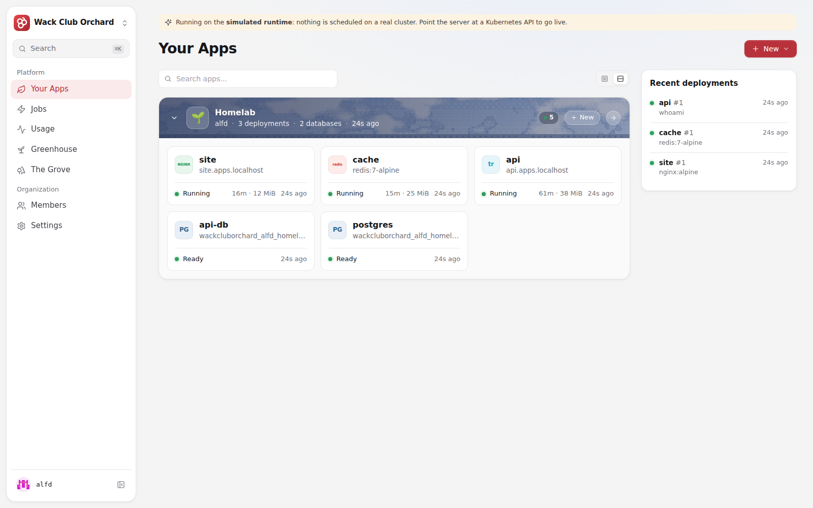
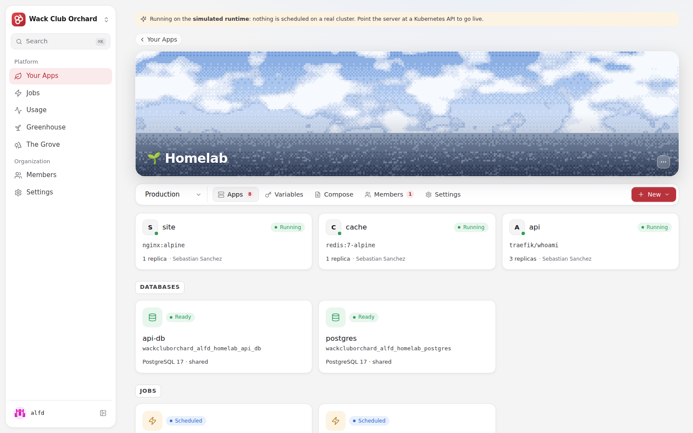
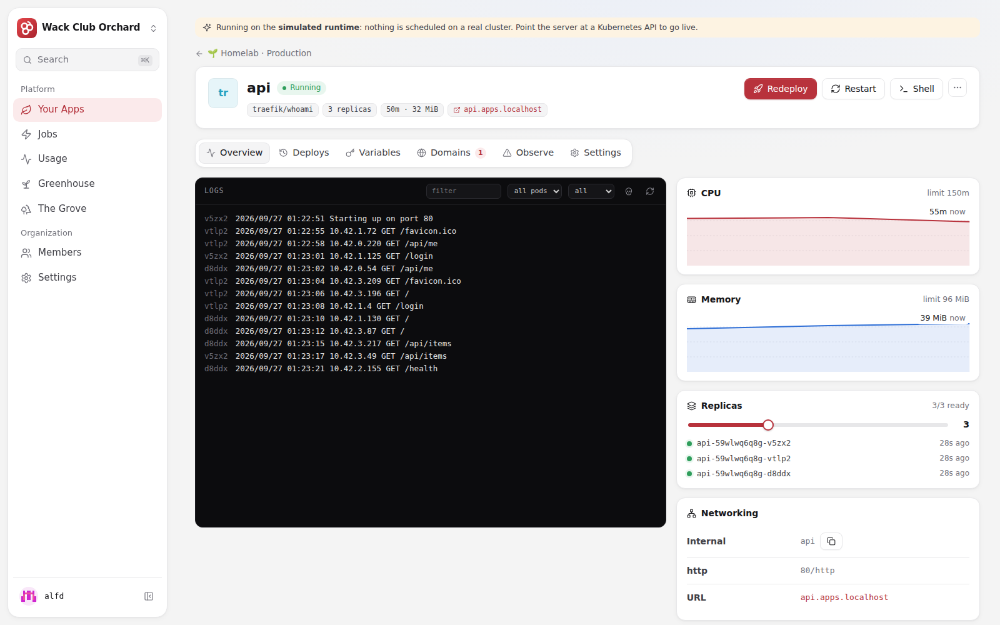
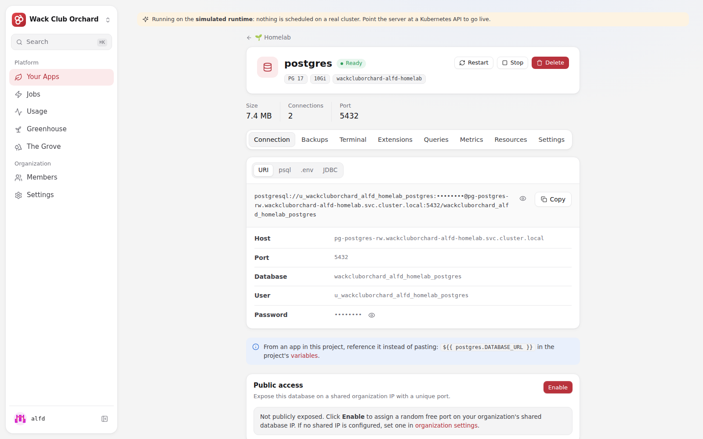
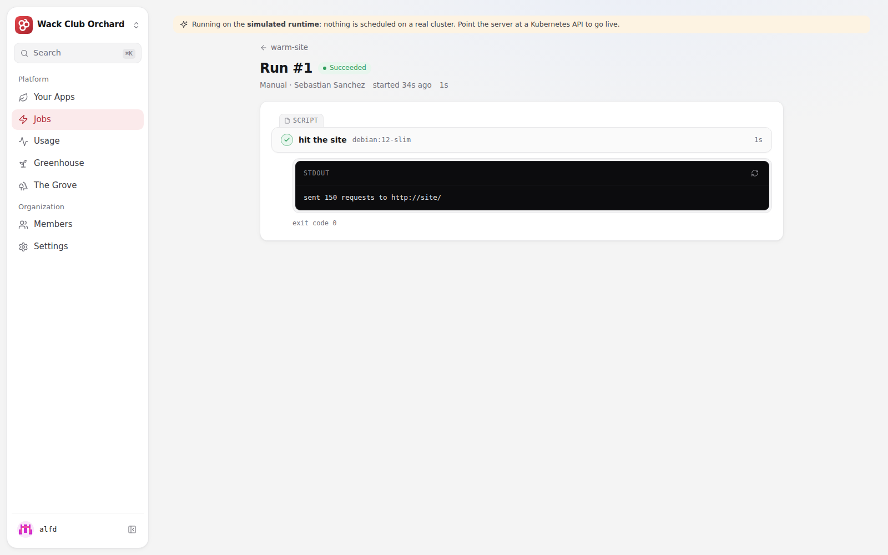
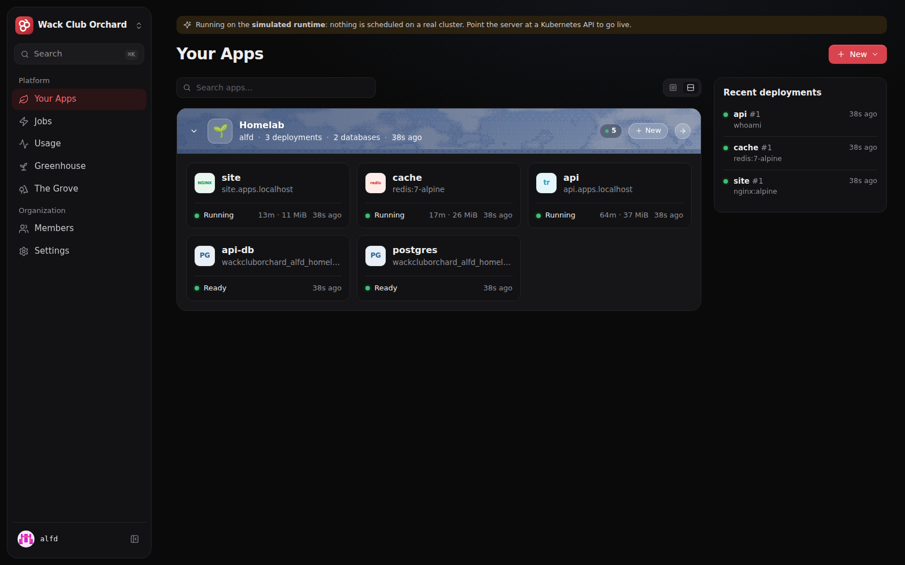
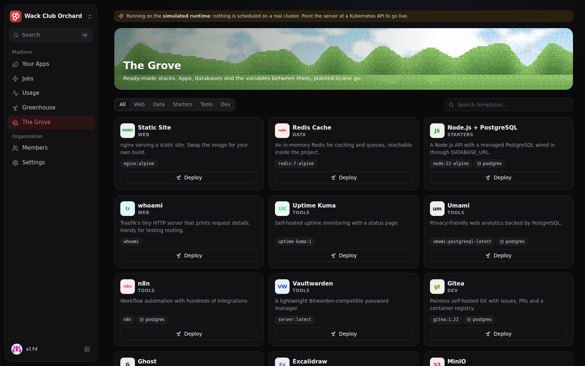

<p align="center"></p>

<h1 align="center">Wack Club Orchard</h1>

<p align="center">A self-hosted platform layer for Kubernetes, in the spirit of Coolify or Dokploy but Kubernetes-native.<br>Connect a GitHub repo and Wack Club Orchard builds it, runs it, routes traffic to it, gives it a database, and shows you the logs when it breaks.</p>



## What you get

| | |
| --- | --- |
| **Deploys** | GitHub repos (built on the cluster with BuildKit) or container images, five-step progress with streaming build logs, push-to-deploy, one-click rollbacks to any earlier image |
| **Routing** | An HTTPS URL per app on the app domain, custom domains with automatic certificates, an auth wall that admits only project members |
| **Data** | Managed PostgreSQL on CloudNativePG: URI/psql/.env/JDBC connection strings, backups on a schedule, extensions, read replicas, a query console, a psql terminal, public exposure on the org IP |
| **Jobs** | Cron schedules and multi-step pipelines (bash, python, node, app commands, custom images) with per-step output and exit codes and a concurrency policy |
| **Visibility** | Live logs filtered by pod and time, the previous container's logs, crash reports captured from containers that already died, CPU and memory over time, Kubernetes warnings in plain English |
| **Greenhouse** | Kata-isolated cloud dev sandboxes with a file editor, terminal, git panel and a Claude agent working on the real workspace |
| **The Grove** | One-click templates (Node + Postgres, Umami, n8n, Gitea, Uptime Kuma, Vaultwarden, MinIO, Metabase…) and docker-compose import |
| **Teams** | Organizations, projects, environments, roles (owner/admin/member/viewer), passkeys, OIDC SSO, SCIM provisioning, audit logs, org caps and per-member quotas, node pools |
| **Interfaces** | A web dashboard (light and dark), the `wackcluborchard` CLI, `wackcluborchardctl` for operators, a REST API, and an MCP server so agents can drive it |

<table>
<tr>
<td></td>
<td></td>
</tr>
<tr>
<td></td>
<td></td>
</tr>
<tr>
<td></td>
<td></td>
</tr>
</table>

## Try it in ten seconds

No cluster needed: without a reachable Kubernetes API the server uses a **simulated runtime** that fakes pods, builds, logs, metrics and databases in-process, and seeds a demo project for the first account.

```bash
go run ./cmd/wackcluborchard-server        # http://localhost:8080
```

Sign up, then open the claim link the server printed to become the instance superadmin. `make dev` does the same with the dashboard served from disk, so `./web/build.sh` shows up on reload.

## Install it for real

On a bare amd64 Linux box (it brings k3s, Traefik with the Gateway API, cert-manager, CloudNativePG and a zot registry):

```bash
sudo bash -c "$(curl -fsSL https://raw.githubusercontent.com/evanxdsouza/wackcluborchard/main/deploy/install.sh)"
```

On a cluster you already run, use the Helm chart in [`deploy/helm/wackcluborchard`](deploy/helm/wackcluborchard) and bring the platform layer below it. See [Install](docs/start/install.md).

## How it is built

Everything is written against the standard library: **no third-party Go modules and no npm packages.**

| Piece | What it is |
| --- | --- |
| `cmd/wackcluborchard-server` | The control plane: API, dashboard, MCP endpoint, SSE event stream, WebSocket terminals, build queue, job scheduler |
| `internal/kube` | A small Kubernetes client over `net/http`: server-side apply, list/watch informers, pod logs, exec over the v4 WebSocket channel protocol |
| `internal/runtime` | The driver boundary. `kube.go` renders Deployments, Services, HTTPRoutes, Ingresses, NetworkPolicies, BuildKit build Jobs, CloudNativePG Clusters and Kata sandboxes; `sim.go` fakes all of it |
| `internal/platform` | Desired state and reconciliation: a retrying, coalescing apply queue, bounded build slots, deploy pipeline, quotas, variable resolution with `${{ db.DATABASE_URL }}` references, templates and compose |
| `internal/store` | Control-plane state: an in-memory document store snapshotted atomically to disk; informers mirror cluster state into it so reads never hit the cluster |
| `internal/api` | HTTP handlers, sessions, passkeys (WebAuthn), OIDC SSO, SCIM 2.0, GitHub App manifest flow and webhooks, the MCP server |
| `web/` | The dashboard: TypeScript compiled by plain `tsc` with a ~400-line JSX runtime (`web/src/lib/sprout.ts`); generated pixel-sky banners and critter avatars |
| `cmd/wackcluborchard`, `cmd/wackcluborchardctl` | The user CLI and the on-box operator tool |

More in [Architecture](docs/operate/architecture.md).

## Develop

```bash
make test     # go test ./... and a TypeScript type check
make web      # rebuild web/dist (needs only tsc)
make build    # bin/wackcluborchard-server, bin/wackcluborchard, bin/wackcluborchardctl
make image    # container image
```

`web/dist` is committed so `go build` works without Node. Set `WACKCLUBORCHARD_SIM_EXEC=1` to have the simulator actually run job script steps with local interpreters (development only: there is no isolation).

## Docs

- Start: [What is Wack Club Orchard](docs/start/what-is-wackcluborchard.md) · [Install](docs/start/install.md) · [First deploy](docs/start/first-deploy.md) · [Concepts](docs/start/concepts.md)
- Deploy: [Builds](docs/deploy/builds.md) · [Domains and HTTPS](docs/deploy/domains.md) · [Scaling and resources](docs/deploy/scaling.md) · [Rollbacks](docs/deploy/rollbacks.md)
- Run: [Environments and variables](docs/run/environments.md) · [Jobs](docs/run/jobs.md) · [Logs and shell](docs/run/logs.md) · [Sandboxes](docs/run/sandboxes.md)
- Data: [Databases](docs/data/databases.md)
- Teams: [Organizations, roles, SSO and quotas](docs/teams/organizations.md)
- Interfaces: [CLI](docs/interfaces/cli.md) · [MCP](docs/interfaces/mcp.md) · [API](docs/interfaces/api.md)
- Operate: [Architecture](docs/operate/architecture.md) · [Nodes and pools](docs/operate/nodes.md) · [Security](docs/operate/security.md) · [Going to production](docs/operate/production.md) · [Configuration](docs/reference/configuration.md)
